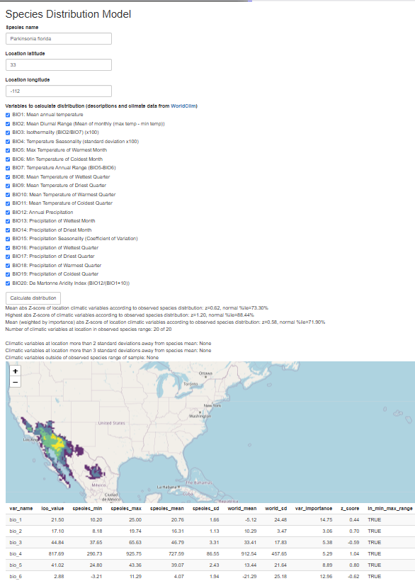

# speciesdistmap
Mapping and modeling species distributions

## Requirements

Libraries: pacman, rgbif, geodata, tidyverse, viridis, shiny, leaflet

## Usage

Run the shiny app at `app.R`, and enter a binomial species name, a location latitude and longitude,
and a selection of variables to use in the model, and the app will produce suitability statistics
for the location, a world suitability map for the species, and a table of climatic variable 
statistics for the location and the distribution of the species.

## About

The species distribution model involves calculating the mean and standard deviation for
each bioclimatic variable (data from [WorldClim](https://www.worldclim.org/)) at each 
species occurrence (data from [GBIF](https://www.gbif.org/)) 
to get the species niche, calculating the Z-score for each bioclimatic variable
based on these statistics for each grid on the world map, and suitability for each grid square 
is calculated as the maximum absolute Z-score relative to the species niche.